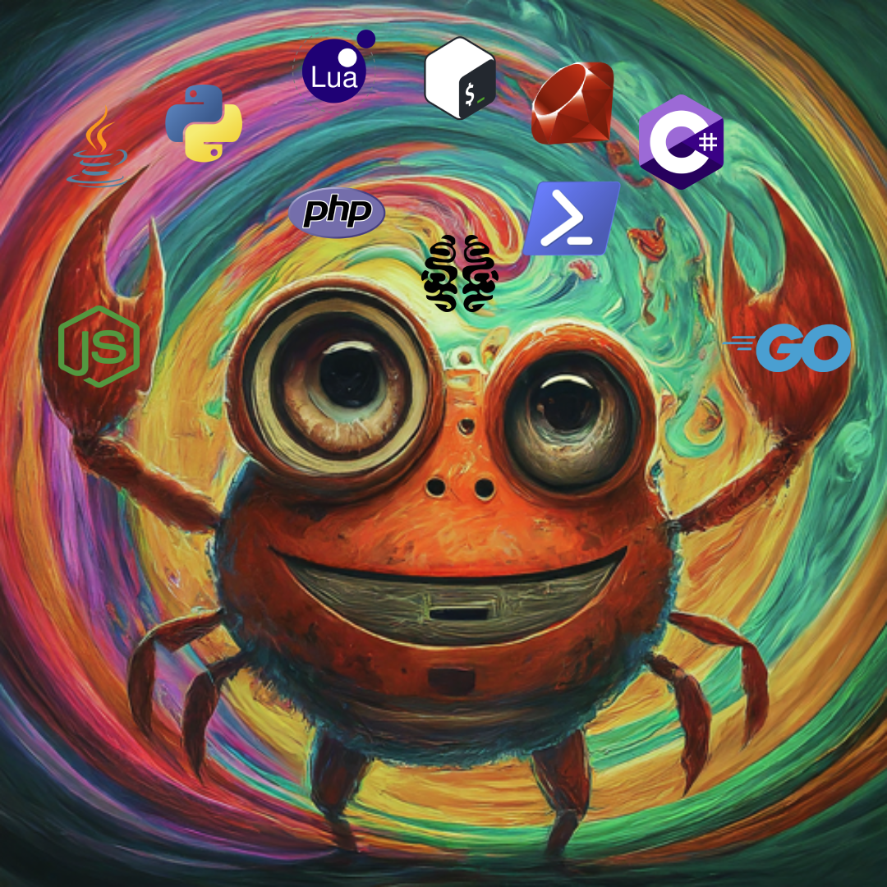

# Huriha: The Polyglot Web Server

<div align="center">

   
   
   
   
   
   

</div>

Welcome to Huriha, the web server that can already talk to middlewares written in any programming language! The name "Huriha" (pronounced "Hu-ri-haa") comes from the Dhivehi language, meaning "all" or "every" - a fitting name for the goal of building a server with all and every programming language.



This project is built on top of the excellent Actix Web framework, which is a great choice for building web servers in Rust.

## The Vision

Imagine a world where web servers are no longer constrained by the boundaries of a single language. Imagine a world where you can have a middleware written in Rust, another in Python, and yet another in Brainfuck (yes, really!). That's the dream I'm chasing with Huriha.

## The Current State

As of now, Huriha is just a tiny Rust embryo, but it's a start! I've got a basic server up and running, and it can execute middleware executables written in any language. The possibilities are endless, but I've only scratched the surface.

## Performance
Real world performance would probably depend on a lot of factors, like the languages you use for your middlewares and the work you do with them, the data clients submit and et cetera. In a small batch benchmark I did, with about 1000 requests and the example middlewares, it takes about `90ms` per request, where the node.js middleware takes `28.77ms` and the bash middleware takes `61.83ms`. So expect each middleware to give the performance a small hit. This test was done on a x86_64 Linux 6.8.7-200 machine equipped with an AMD Ryzen 7 5700G.

## Download
To download the latest build, simply head to the [releases](https://github.com/DaniAsh551/huriha/releases). Currently, there are builds for gnu-linux and windows on x86_64.

## Building Huriha

To build Huriha, you'll need the latest stable version of Rust installed on your system. Then, follow these simple steps:

1. Clone this repository:
   ```
   git clone https://github.com/DaniAsh551/huriha.git
   ```

2. Navigate to the project directory:
   ```
   cd huriha
   ```

3. Build the project:
   ```
   cargo build --release
   ```

4. Run the server:
   ```
   cargo run --release
   ```

And that's it! You should see a message saying "Huriha Server listening on: 127.0.0.1:8888". Now you're ready to start experimenting with middleware executables.

## Developer Documentation

If you're interested in contributing to Huriha or writing your own middleware, be sure to check out the [developer documentation](developer.md). It explains how to write and add middleware executables, as well as other details about the project's architecture.

## Contributing

I welcome contributions from anyone who shares my love for polyglot programming and web servers. Whether you're a seasoned developer or just starting out, there's a place for you in the Huriha community.

To contribute, simply fork this repository, make your changes, and submit a pull request. I'll review your code and, if everything looks good, I'll merge it into the main codebase.

## License

Huriha is released under the [Fair Source License](https://fair.io/).

## Conclusion

Huriha is a wild and ambitious project, but that's what makes it fun! I'm not sure where this journey will take me, but I'm excited to find out. So join me, and let's build the most polyglot web server the world has ever seen!
